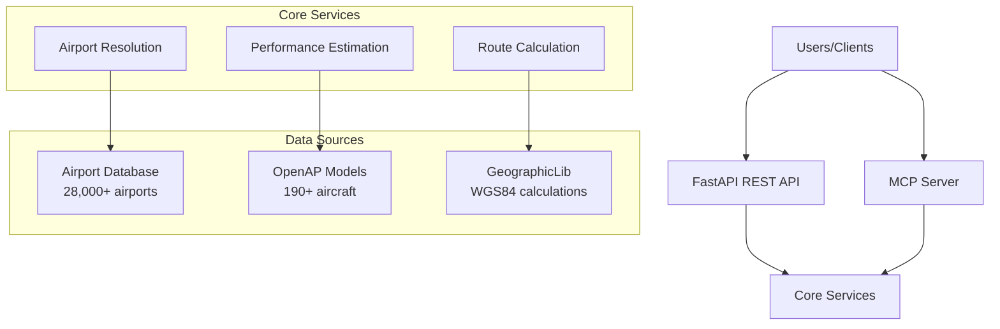

# Aerospace MCP - Flight Planning API & MCP Server

[](https://www.python.org/downloads/)
[](https://fastapi.tiangolo.com/)
[](https://github.com/TUDelft-CNS-ATM/openap)
[](https://modelcontextprotocol.io/)
[](https://opensource.org/licenses/MIT)

A comprehensive flight planning service providing both HTTP API and Model Context Protocol (MCP) integration for aerospace operations. Features intelligent airport resolution, great-circle route calculation, and aircraft performance estimation using OpenAP.

## ⚠️ SAFETY DISCLAIMER

**THIS SOFTWARE IS FOR EDUCATIONAL, RESEARCH, AND DEVELOPMENT PURPOSES ONLY**

- **NOT FOR REAL NAVIGATION**: Do not use for actual flight planning or navigation
- **NOT CERTIFIED**: This system is not certified by any aviation authority  
- **ESTIMATES ONLY**: Performance calculations are theoretical estimates
- **NO WEATHER DATA**: Does not account for weather, NOTAMs, or airspace restrictions
- **NO LIABILITY**: Authors assume no responsibility for any consequences of use

For real flight planning, always use certified aviation software and consult official sources including NOTAMs, weather reports, and air traffic control.

## 🚀 Quick Start

### Option 1: UV (Recommended)

```bash
# Install UV (fast Python package manager)
curl -LsSf https://astral.sh/uv/install.sh | sh

# Clone and setup
git clone https://github.com/username/aerospace-mcp.git
cd aerospace-mcp
uv venv && source .venv/bin/activate  # Windows: .venv\Scripts\activate
uv add fastapi uvicorn airportsdata geographiclib openap

# Run HTTP server
uvicorn main:app --reload --host 0.0.0.0 --port 8000

# Test the API
curl "http://localhost:8000/health"
```

### Option 2: Docker

```bash
git clone https://github.com/username/aerospace-mcp.git
cd aerospace-mcp
docker build -t aerospace-mcp .
docker run -p 8000:8000 aerospace-mcp

# Test the API
curl "http://localhost:8000/health"
```

### Option 3: MCP Client (Claude Desktop)

Add to your Claude Desktop configuration:

```json
{
  "mcpServers": {
    "aerospace-mcp": {
      "command": "python",
      "args": ["-m", "aerospace_mcp.server"],
      "cwd": "/path/to/aerospace-mcp"
    }
  }
}
```

## 📋 Table of Contents

- [Features](#features)
- [Installation](#installation)
- [Usage Examples](#usage-examples)
- [Architecture](#architecture)
- [Performance](#performance)
- [API Documentation](#api-documentation)
- [MCP Integration](#mcp-integration)
- [Development](#development)
- [Contributing](#contributing)
- [License](#license)

## ✨ Features

### Core Capabilities

- **Airport Resolution**: Intelligent city-to-airport mapping with 28,000+ airports worldwide
- **Route Planning**: Great-circle distance calculation with geodesic precision
- **Performance Estimation**: Aircraft-specific fuel and time calculations via OpenAP
- **Multiple Interfaces**: HTTP REST API and Model Context Protocol (MCP) support
- **Real-time Processing**: Sub-second response times for flight planning requests

### Supported Operations

- ✅ Airport search by city name or IATA code
- ✅ Flight route planning with polyline generation
- ✅ Aircraft performance estimation (190+ aircraft types)
- ✅ Fuel consumption and flight time calculations
- ✅ Great-circle distance calculations
- ✅ Multi-leg journey planning
- ✅ Aircraft comparison analysis

### Technical Features

- 🚀 **Fast**: In-memory airport database for microsecond lookups
- 🔧 **Flexible**: Pluggable backend system (currently OpenAP)
- 📊 **Accurate**: Uses WGS84 geodesic calculations
- 🌐 **Standards**: Follows ICAO aircraft codes and IATA airport codes
- 🔒 **Reliable**: Comprehensive error handling and graceful degradation
- 📚 **Well-documented**: Complete API documentation with examples

## 💾 Installation

### System Requirements

- **Python**: 3.11+ (3.12+ recommended for best performance)
- **Memory**: 512MB RAM minimum (1GB+ recommended)
- **Storage**: 200MB free space
- **Network**: Internet connection for initial setup

### Method 1: UV Package Manager (Recommended)

UV is the fastest Python package manager and provides excellent dependency resolution:

```bash
# Install UV
curl -LsSf https://astral.sh/uv/install.sh | sh  # Linux/macOS
# Or: powershell -c "irm https://astral.sh/uv/install.ps1 | iex"  # Windows

# Clone repository
git clone https://github.com/username/aerospace-mcp.git
cd aerospace-mcp

# Create virtual environment
uv venv
source .venv/bin/activate  # Linux/macOS
# .venv\Scripts\activate     # Windows

# Install dependencies
uv add fastapi uvicorn[standard] airportsdata geographiclib pydantic
uv add openap  # Optional: for performance estimates
uv add mcp     # Optional: for MCP server functionality

# Install development dependencies (optional)
uv add --dev pytest httpx black isort mypy pre-commit

# Verify installation
python -c "import main; print('✅ Installation successful')"
```

### Method 2: Pip (Traditional)

```bash
# Clone repository
git clone https://github.com/username/aerospace-mcp.git
cd aerospace-mcp

# Create virtual environment
python -m venv .venv
source .venv/bin/activate  # Linux/macOS
# .venv\Scripts\activate     # Windows

# Upgrade pip
pip install --upgrade pip

# Install core dependencies
pip install fastapi uvicorn[standard] airportsdata geographiclib pydantic

# Install optional dependencies
pip install openap  # For performance estimates
pip install mcp     # For MCP server

# Install from pyproject.toml
pip install -e .

# Verify installation
python -c "import main; print('✅ Installation successful')"
```

### Method 3: Docker

```bash
# Clone repository
git clone https://github.com/username/aerospace-mcp.git
cd aerospace-mcp

# Build image
docker build -t aerospace-mcp .

# Run container
docker run -d -p 8000:8000 --name aerospace-mcp aerospace-mcp

# Health check
curl http://localhost:8000/health

# View logs
docker logs aerospace-mcp

# Stop container
docker stop aerospace-mcp
```

### Method 4: Conda/Mamba

```bash
# Create conda environment
conda create -n aerospace-mcp python=3.11
conda activate aerospace-mcp

# Clone repository
git clone https://github.com/username/aerospace-mcp.git
cd aerospace-mcp

# Install dependencies
conda install fastapi uvicorn pydantic
pip install airportsdata geographiclib openap mcp

# Verify installation
python -c "import main; print('✅ Installation successful')"
```

### Troubleshooting Installation

#### Common Issues

**OpenAP Installation Problems**:
```bash
# Try these alternatives if OpenAP fails to install
pip install openap --no-cache-dir
pip install openap --force-reinstall
# Or install without OpenAP (performance estimates will be unavailable)
```

**GeographicLib Issues**:
```bash
# Install system dependencies (Ubuntu/Debian)
sudo apt-get install libproj-dev proj-data proj-bin

# Install system dependencies (macOS)
brew install proj

# Install system dependencies (Windows)
# Download from: https://proj.org/download.html
```

**Import Errors**:
```bash
# Verify your Python environment
python --version  # Should be 3.11+
pip list | grep -E "(fastapi|openap|airportsdata)"

# Test individual imports
python -c "import fastapi; print('FastAPI OK')"
python -c "import airportsdata; print('AirportsData OK')"
python -c "import openap; print('OpenAP OK')" || echo "OpenAP not available (optional)"
```

## 🎯 Usage Examples

### HTTP API Examples

#### Basic Flight Planning

```bash
# Plan a simple flight
curl -X POST "http://localhost:8000/plan" \
  -H "Content-Type: application/json" \
  -d '{
    "depart_city": "San Francisco",
    "arrive_city": "New York",
    "ac_type": "A320",
    "cruise_alt_ft": 37000,
    "backend": "openap"
  }'
```

#### Airport Search

```bash
# Find airports by city
curl "http://localhost:8000/airports/by_city?city=Tokyo"

# Filter by country
curl "http://localhost:8000/airports/by_city?city=London&country=GB"

# Multiple results
curl "http://localhost:8000/airports/by_city?city=Paris"
```

#### Advanced Flight Planning

```bash
# Specify exact airports and aircraft mass
curl -X POST "http://localhost:8000/plan" \
  -H "Content-Type: application/json" \
  -d '{
    "depart_city": "Los Angeles",
    "arrive_city": "Tokyo", 
    "prefer_depart_iata": "LAX",
    "prefer_arrive_iata": "NRT",
    "ac_type": "B777",
    "cruise_alt_ft": 39000,
    "mass_kg": 220000,
    "route_step_km": 100.0,
    "backend": "openap"
  }'
```

### Python Client Examples

#### Simple Client

```python
import requests
import json

class AerospaceClient:
    def __init__(self, base_url="http://localhost:8000"):
        self.base_url = base_url
    
    def plan_flight(self, departure, arrival, aircraft="A320", altitude=35000):
        """Plan a flight between two cities."""
        response = requests.post(f"{self.base_url}/plan", json={
            "depart_city": departure,
            "arrive_city": arrival,
            "ac_type": aircraft,
            "cruise_alt_ft": altitude,
            "backend": "openap"
        })
        return response.json()
    
    def find_airports(self, city, country=None):
        """Find airports in a city."""
        params = {"city": city}
        if country:
            params["country"] = country
        response = requests.get(f"{self.base_url}/airports/by_city", params=params)
        return response.json()

# Usage
client = AerospaceClient()

# Find airports
airports = client.find_airports("Sydney", "AU")
print(f"Sydney has {len(airports)} airports")

# Plan flight
plan = client.plan_flight("Sydney", "Melbourne", "B737")
print(f"Flight distance: {plan['distance_nm']:.0f} NM")
print(f"Flight time: {plan['estimates']['block']['time_min']:.0f} minutes")
```

#### Batch Processing

```python
import asyncio
import aiohttp
from typing import List, Dict

async def plan_multiple_flights(flights: List[Dict]) -> List[Dict]:
    """Plan multiple flights concurrently."""
    async with aiohttp.ClientSession() as session:
        tasks = []
        for flight in flights:
            task = plan_single_flight(session, flight)
            tasks.append(task)
        
        results = await asyncio.gather(*tasks, return_exceptions=True)
        return results

async def plan_single_flight(session, flight_data):
    """Plan a single flight."""
    async with session.post(
        "http://localhost:8000/plan",
        json=flight_data
    ) as response:
        return await response.json()

# Example usage
flights_to_plan = [
    {"depart_city": "New York", "arrive_city": "London", "ac_type": "A330"},
    {"depart_city": "London", "arrive_city": "Dubai", "ac_type": "B777"},
    {"depart_city": "Dubai", "arrive_city": "Singapore", "ac_type": "A350"}
]

# Run the batch planning
results = asyncio.run(plan_multiple_flights(flights_to_plan))
for i, result in enumerate(results):
    if not isinstance(result, Exception):
        print(f"Flight {i+1}: {result['distance_nm']:.0f} NM, {result['estimates']['block']['time_min']:.0f} min")
```

### JavaScript/TypeScript Examples

```typescript
interface FlightPlan {
  depart_city: string;
  arrive_city: string;
  ac_type: string;
  cruise_alt_ft?: number;
  backend: "openap";
}

class AerospaceAPI {
  constructor(private baseUrl: string = "http://localhost:8000") {}

  async planFlight(request: FlightPlan) {
    const response = await fetch(`${this.baseUrl}/plan`, {
      method: "POST",
      headers: { "Content-Type": "application/json" },
      body: JSON.stringify(request),
    });
    
    if (!response.ok) {
      throw new Error(`API Error: ${response.statusText}`);
    }
    
    return await response.json();
  }

  async findAirports(city: string, country?: string) {
    const params = new URLSearchParams({ city });
    if (country) params.append("country", country);
    
    const response = await fetch(`${this.baseUrl}/airports/by_city?${params}`);
    return await response.json();
  }
}

// Usage
const api = new AerospaceAPI();

try {
  const plan = await api.planFlight({
    depart_city: "Boston",
    arrive_city: "Seattle",
    ac_type: "B737",
    cruise_alt_ft: 36000,
    backend: "openap"
  });
  
  console.log(`Flight planned: ${plan.distance_nm} NM`);
  console.log(`Estimated time: ${plan.estimates.block.time_min} minutes`);
} catch (error) {
  console.error("Flight planning failed:", error);
}
```

## 🏗️ Architecture

### System Overview



### Key Components

1. **FastAPI Application** (`main.py`)
   - RESTful endpoints for HTTP clients
   - Auto-generated OpenAPI documentation
   - Request/response validation with Pydantic

2. **MCP Server** (`aerospace_mcp/server.py`)
   - Model Context Protocol implementation
   - Tool-based interface for AI assistants
   - Async request handling

3. **Core Services**
   - **Airport Resolution**: City → Airport mapping with intelligent selection
   - **Route Calculation**: Great-circle paths with polyline generation
   - **Performance Estimation**: OpenAP-based fuel and time calculations

4. **Data Layer**
   - **In-memory Airport Database**: 28,000+ airports loaded at startup
   - **OpenAP Integration**: Aircraft performance models
   - **GeographicLib**: Precise geodesic calculations

### Design Principles

- **Performance First**: In-memory data structures for sub-millisecond lookups
- **Graceful Degradation**: Works without optional dependencies
- **Type Safety**: Full type hints and Pydantic validation
- **Extensible**: Plugin architecture for new backends
- **Standards Compliant**: ICAO, IATA, and OpenAP standards

## ⚡ Performance

### Benchmarks

| Operation | Response Time | Throughput | Memory Usage |
|-----------|---------------|------------|--------------|
| Health Check | < 1ms | 10,000+ req/sec | ~5MB |
| Airport Search | 1-5ms | 1,000+ req/sec | ~50MB |
| Flight Planning | 200-500ms | 5-10 req/sec | ~100MB |
| Distance Calc | 10-50ms | 100+ req/sec | ~50MB |

### Optimization Tips

1. **Route Resolution**: Use larger `route_step_km` values for faster processing
2. **Caching**: Implement client-side caching for repeated requests  
3. **Batch Processing**: Use async clients for multiple concurrent requests
4. **Memory**: Increase available RAM for better OpenAP performance

### Scaling Considerations

- **Horizontal Scaling**: Stateless design allows multiple instances
- **Load Balancing**: Standard HTTP load balancers work well
- **Database**: Consider external database for airport data at scale
- **Caching**: Add Redis for shared cache across instances

## 📖 API Documentation

### Interactive Documentation

When running the server, comprehensive API documentation is available at:
- **Swagger UI**: http://localhost:8000/docs
- **ReDoc**: http://localhost:8000/redoc
- **OpenAPI Schema**: http://localhost:8000/openapi.json

### Core Endpoints

#### GET /health
Health check and system status.

**Response**:
```json
{
  "status": "ok",
  "openap": true,
  "airports_count": 28756
}
```

#### GET /airports/by_city
Search airports by city name.

**Parameters**:
- `city` (required): City name to search
- `country` (optional): ISO country code filter

**Example**: `GET /airports/by_city?city=London&country=GB`

#### POST /plan
Generate complete flight plan.

**Request Body**:
```json
{
  "depart_city": "San Francisco",
  "arrive_city": "New York",
  "ac_type": "A320",
  "cruise_alt_ft": 37000,
  "mass_kg": 65000,
  "route_step_km": 25.0,
  "backend": "openap"
}
```

**Response**: Complete flight plan with route polyline and performance estimates.

### Error Handling

All endpoints return standard HTTP status codes:
- `200`: Success
- `400`: Bad Request (invalid parameters)
- `404`: Not Found (airport/city not found)
- `501`: Not Implemented (backend unavailable)

Error responses include detailed messages:
```json
{
  "detail": "departure: IATA 'XYZ' not found."
}
```

## 🤖 MCP Integration

### Supported MCP Clients

- **Claude Desktop**: Native integration
- **VS Code Continue**: Plugin support
- **Custom Clients**: Standard MCP protocol

### Available Tools

| Tool | Description | Parameters |
|------|-------------|------------|
| `search_airports` | Find airports by IATA or city | `query`, `country`, `query_type` |
| `plan_flight` | Complete flight planning | `departure`, `arrival`, `aircraft`, `route_options` |
| `calculate_distance` | Great-circle distance | `origin`, `destination`, `step_km` |
| `get_aircraft_performance` | Performance estimates | `aircraft_type`, `distance_km`, `cruise_altitude` |
| `get_system_status` | System health check | None |

### Claude Desktop Setup

1. Open Claude Desktop Settings
2. Add server configuration:

```json
{
  "mcpServers": {
    "aerospace-mcp": {
      "command": "python",
      "args": ["-m", "aerospace_mcp.server"],
      "cwd": "/path/to/aerospace-mcp",
      "env": {
        "PYTHONPATH": "/path/to/aerospace-mcp"
      }
    }
  }
}
```

3. Restart Claude Desktop
4. Test with: "Search for airports in Tokyo"

### VS Code Continue Setup

Add to your `config.json`:

```json
{
  "mcpServers": [
    {
      "name": "aerospace-mcp",
      "command": "python",
      "args": ["-m", "aerospace_mcp.server"],
      "workingDirectory": "/path/to/aerospace-mcp"
    }
  ]
}
```

## 🛠️ Development

### Development Setup

```bash
# Clone and setup
git clone https://github.com/username/aerospace-mcp.git
cd aerospace-mcp

# Create development environment
uv venv
source .venv/bin/activate
uv add --dev pytest httpx black isort mypy pre-commit

# Install pre-commit hooks
pre-commit install

# Run development server
uvicorn main:app --reload --log-level debug
```

### Testing

```bash
# Run all tests
pytest

# Run with coverage
pytest --cov=. --cov-report=html

# Run specific test file
pytest tests/test_main.py -v

# Performance testing
pytest tests/test_performance.py -v
```

### Code Quality

```bash
# Format code
black . && isort .

# Type checking
mypy main.py aerospace_mcp/

# Linting
ruff check .

# Pre-commit (runs all checks)
pre-commit run --all-files
```

### Project Structure

```
aerospace-mcp/
├── main.py                 # FastAPI application
├── aerospace_mcp/          # MCP server implementation
│   ├── __init__.py
│   ├── server.py          # MCP server
│   └── core.py            # Shared business logic
├── app/                   # Alternative FastAPI structure
│   ├── __init__.py
│   └── main.py
├── tests/                 # Test suite
│   ├── conftest.py
│   ├── test_main.py
│   ├── test_airports.py
│   ├── test_plan.py
│   └── test_mcp.py
├── docs/                  # Documentation
│   ├── API.md
│   ├── ARCHITECTURE.md
│   ├── INTEGRATION.md
│   ├── QUICKSTART.md
│   ├── DEPLOYMENT.md
│   └── MCP_INTEGRATION.md
├── pyproject.toml         # Project configuration
├── requirements.txt       # Dependencies
├── Dockerfile            # Docker configuration
├── docker-compose.yml    # Multi-service setup
└── README.md             # This file
```

## 🤝 Contributing

We welcome contributions! Please see [CONTRIBUTING.md](docs/CONTRIBUTING.md) for detailed guidelines.

### Quick Contributing Guide

1. **Fork & Clone**
   ```bash
   git clone https://github.com/yourusername/aerospace-mcp.git
   cd aerospace-mcp
   ```

2. **Setup Development Environment**
   ```bash
   uv venv && source .venv/bin/activate
   uv add --dev pytest httpx black isort mypy
   ```

3. **Make Changes**
   - Add features or fix bugs
   - Write tests for new functionality
   - Update documentation as needed

4. **Test & Format**
   ```bash
   pytest
   black . && isort .
   mypy main.py
   ```

5. **Submit Pull Request**
   - Clear title and description
   - Reference any related issues
   - Ensure CI/CD checks pass

### Areas for Contribution

- **New Aircraft Support**: Add more aircraft types to OpenAP
- **Weather Integration**: Add weather data sources
- **Route Optimization**: Implement waypoint optimization
- **UI/Frontend**: Web interface for flight planning
- **Database Backend**: PostgreSQL/MongoDB integration
- **Performance**: Optimization and caching improvements

## 📚 Documentation

### Complete Documentation

- [**Quick Start Guide**](docs/QUICKSTART.md) - Get up and running in 5 minutes
- [**API Reference**](docs/API.md) - Complete REST API documentation
- [**MCP Integration**](docs/MCP_INTEGRATION.md) - Model Context Protocol setup
- [**Architecture Guide**](docs/ARCHITECTURE.md) - System design and components
- [**Deployment Guide**](docs/DEPLOYMENT.md) - Production deployment strategies
- [**Contributing Guide**](docs/CONTRIBUTING.md) - Development and contribution guidelines
- [**Integration Guide**](docs/INTEGRATION.md) - Client integration examples

### Examples Repository

Check out the [examples repository](https://github.com/username/aerospace-mcp-examples) for:
- Complete client implementations
- Integration patterns
- Performance benchmarks
- Real-world use cases

## 📄 License

This project is licensed under the MIT License - see the [LICENSE](LICENSE) file for details.

### Third-Party Acknowledgments

- **OpenAP**: Aircraft performance modeling - [TU Delft](https://github.com/TUDelft-CNS-ATM/openap)
- **AirportsData**: Airport database - [mborsetti](https://github.com/mborsetti/airportsdata)
- **GeographicLib**: Geodesic calculations - [Charles Karney](https://geographiclib.sourceforge.io/)
- **FastAPI**: Modern web framework - [Sebastián Ramírez](https://github.com/tiangolo/fastapi)

## 🆘 Support & Community

### Getting Help

- **GitHub Issues**: Bug reports and feature requests
- **GitHub Discussions**: Questions and community support
- **Documentation**: Comprehensive guides in `/docs`
- **Examples**: Code examples and tutorials

### Community

- **Discord**: [Join our Discord](https://discord.gg/aerospace-mcp) for real-time chat
- **Twitter**: [@AerospaceMCP](https://twitter.com/AerospaceMCP) for updates
- **Blog**: [Read our blog](https://blog.aerospace-mcp.com) for tutorials and news

### Professional Support

For enterprise support, consulting, or custom development:
- Email: support@aerospace-mcp.com
- Website: https://aerospace-mcp.com
- LinkedIn: [Aerospace MCP](https://linkedin.com/company/aerospace-mcp)

---

**⭐ Star this repository if you find it useful!**

Built with ❤️ for the aviation and software development communities.