# Architecture Documentation

This document provides a comprehensive overview of the Aerospace MCP system design, architecture decisions, and technical considerations.

## Table of Contents

- [System Overview](#system-overview)
- [Component Architecture](#component-architecture)  
- [Data Flow](#data-flow)
- [Technology Stack](#technology-stack)
- [Design Decisions](#design-decisions)
- [Performance Considerations](#performance-considerations)
- [Security Considerations](#security-considerations)
- [Scalability & Future Enhancements](#scalability--future-enhancements)

## System Overview

The Aerospace MCP (Model Context Protocol) system is a flight planning service that provides:

- **Airport Resolution**: Intelligent mapping from city names to airport codes
- **Route Calculation**: Great-circle distance computation with geodesic precision
- **Performance Estimation**: Aircraft-specific fuel and time calculations using OpenAP
- **API Services**: RESTful endpoints and MCP protocol support

### High-Level Architecture

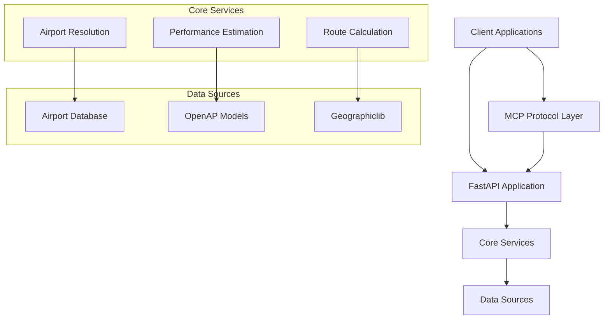

## Component Architecture

### 1. Application Layer (main.py)

The main application serves as the orchestration layer, handling:
- HTTP request/response processing
- Input validation via Pydantic models
- Error handling and status code management
- Dependency coordination

### 2. Core Service Components

#### Airport Resolution Service

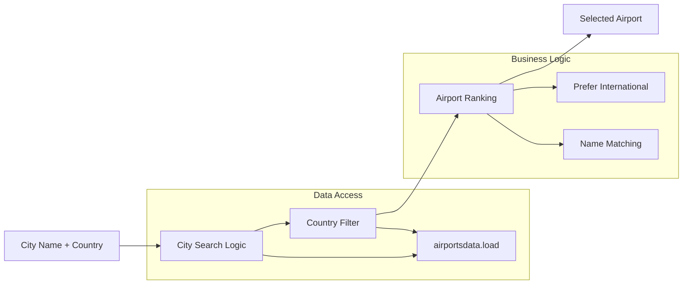

**Key Functions**:
- `_find_city_airports()`: Fuzzy city name matching
- `_resolve_endpoint()`: Airport selection with fallback logic
- `_airport_from_iata()`: Direct IATA code lookup

**Design Patterns**:
- **Strategy Pattern**: Supports city search vs. direct IATA lookup
- **Filter Pattern**: Progressive filtering by city, country, airport type
- **Fallback Pattern**: Graceful degradation when specific airports unavailable

#### Route Calculation Service

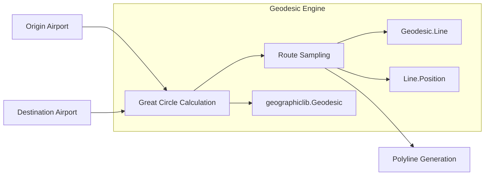

**Key Functions**:
- `great_circle_points()`: Generates sampled route coordinates
- Configurable sampling resolution via `route_step_km`
- WGS84 geodesic calculations for accuracy

**Mathematical Foundation**:
- Uses Vincenty's formulae for geodesic calculations
- Accounts for Earth's ellipsoidal shape (WGS84)
- Samples route at configurable intervals for visualization

#### Performance Estimation Service

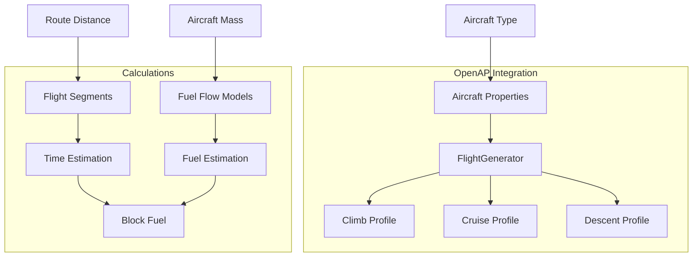

**Key Functions**:
- `estimates_openap()`: OpenAP-based performance calculations
- Aircraft property resolution with MTOW defaults
- Three-phase flight modeling (climb/cruise/descent)

### 3. Data Models & Validation

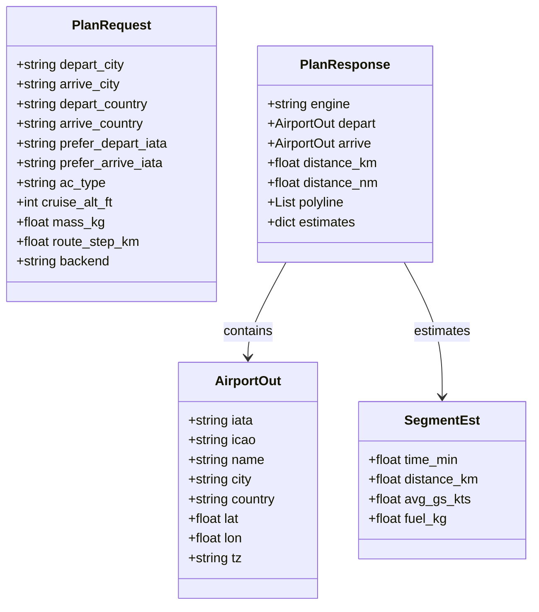

## Data Flow

### Flight Planning Request Flow

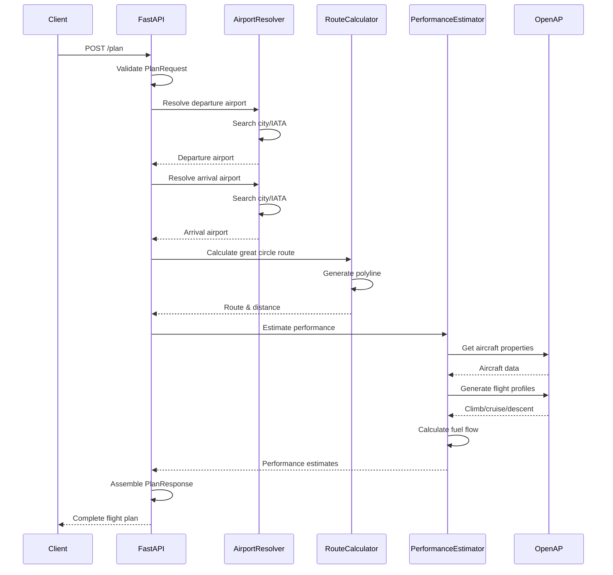

### Error Handling Flow

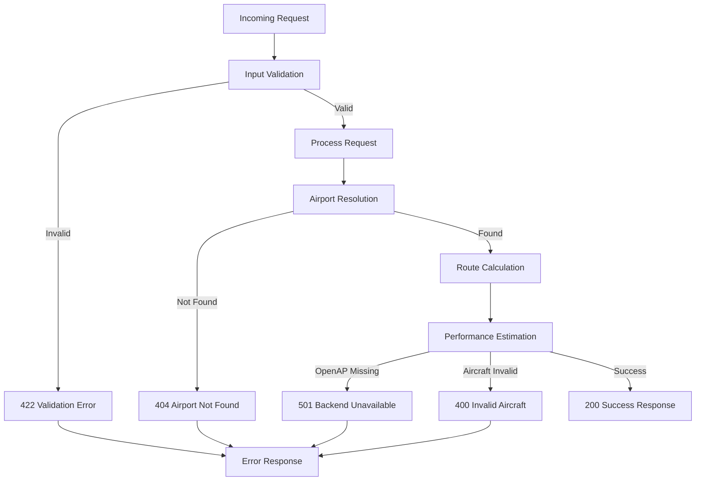

## Technology Stack

### Core Technologies

| Component | Technology | Version | Purpose |
|-----------|------------|---------|---------|
| **Web Framework** | FastAPI | Latest | REST API, async support, auto-docs |
| **Validation** | Pydantic | V2 | Data validation, serialization |
| **Airport Data** | airportsdata | Latest | IATA/ICAO airport database |
| **Geodesics** | geographiclib | Latest | Great-circle calculations |
| **Performance** | OpenAP | Latest | Aircraft performance modeling |
| **ASGI Server** | Uvicorn | Latest | Production ASGI server |

### Development & Testing

| Component | Technology | Purpose |
|-----------|------------|---------|
| **Package Manager** | UV / pip | Dependency management |
| **Testing** | pytest | Unit/integration testing |
| **Type Checking** | mypy | Static type analysis |
| **Formatting** | black, isort | Code formatting |
| **Documentation** | FastAPI + OpenAPI | Auto-generated API docs |

### Data Sources

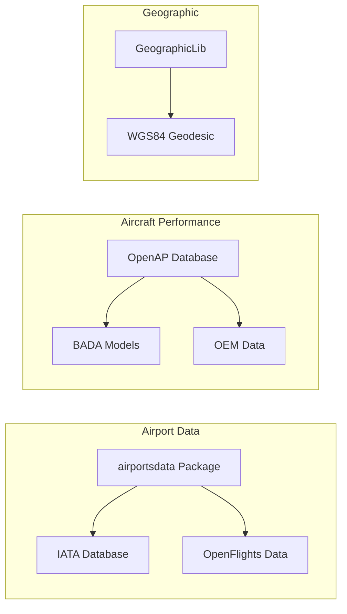

## Design Decisions

### 1. Monolithic vs. Microservices

**Decision**: Monolithic architecture in single `main.py`

**Rationale**:
- **Simplicity**: Single deployment unit, minimal operational complexity
- **Performance**: No inter-service communication overhead
- **Development Speed**: Rapid prototyping and iteration
- **Data Locality**: All operations on shared in-memory data

**Trade-offs**:
- ✅ Faster development, easier debugging, atomic deployments
- ❌ Harder to scale individual components, technology lock-in

### 2. In-Memory vs. Database Storage

**Decision**: In-memory airport data loading at startup

**Rationale**:
- **Performance**: Sub-millisecond airport lookups
- **Simplicity**: No database configuration or management
- **Data Size**: ~28k airports fit comfortably in memory (~50MB)
- **Update Frequency**: Airport data changes infrequently

**Implementation**:
```python
_AIRPORTS_IATA = airportsdata.load("IATA")  # Loaded once at startup
```

**Trade-offs**:
- ✅ Extremely fast lookups, no external dependencies
- ❌ Higher memory usage, startup time, no real-time updates

### 3. Synchronous vs. Asynchronous Processing

**Decision**: Synchronous processing with FastAPI async framework

**Rationale**:
- **CPU-bound Operations**: Flight calculations are computational, not I/O bound
- **Third-party Libraries**: OpenAP and geographiclib are synchronous
- **Complexity**: Async adds complexity without clear benefit for current use case

**Future Consideration**: Could add async for:
- External API calls (weather, NOTAMs)
- Concurrent flight planning requests
- Database operations

### 4. Backend Abstraction Layer

**Decision**: Pluggable backend system with single OpenAP implementation

**Architecture**:
```python
class PlanRequest(BaseModel):
    backend: Literal["openap"] = "openap"  # Extensible enum

def plan(req: PlanRequest):
    if req.backend == "openap":
        return estimates_openap(...)
    # Future: elif req.backend == "eurocontrol":
    #     return estimates_eurocontrol(...)
```

**Rationale**:
- **Extensibility**: Easy to add new performance estimation engines
- **A/B Testing**: Compare different estimation methods
- **Fallback**: Graceful degradation if primary backend unavailable

### 5. Error Handling Strategy

**Decision**: HTTPException-based error handling with detailed messages

**Pattern**:
```python
def _resolve_endpoint(city, country, prefer_iata, role):
    if prefer_iata:
        ap = _airport_from_iata(prefer_iata)
        if not ap:
            raise HTTPException(
                status_code=400, 
                detail=f"{role}: IATA '{prefer_iata}' not found."
            )
    # ... more validation
```

**Benefits**:
- Clear error messages for debugging
- Consistent error format across endpoints
- Proper HTTP status codes for different error types

## Performance Considerations

### Memory Usage

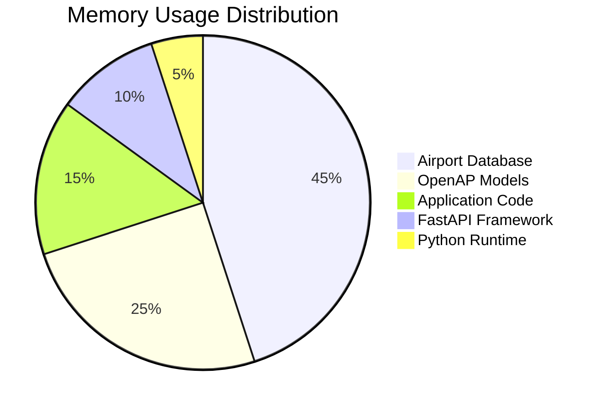

**Airport Database**: ~50MB for 28k airports with geographic data
**OpenAP Models**: Loaded lazily per aircraft type, ~20-30MB per aircraft
**Route Polylines**: Minimal memory (temporary generation)

### CPU Performance

**Bottlenecks** (in order of impact):
1. **OpenAP Calculations**: Flight profile generation (200-500ms)
2. **Geodesic Calculations**: Route sampling (10-50ms)  
3. **Airport Search**: City name fuzzy matching (1-5ms)
4. **JSON Serialization**: Pydantic model conversion (1-2ms)

**Optimization Strategies**:
- Cache OpenAP aircraft properties
- Optimize route sampling resolution
- Pre-compute common city-airport mappings
- Use more efficient JSON serialization

### Scalability Metrics

Current single-threaded performance estimates:
- **Health checks**: 10,000+ req/sec
- **Airport searches**: 1,000+ req/sec  
- **Flight planning**: 5-10 req/sec (OpenAP-limited)

**Scaling Strategies**:
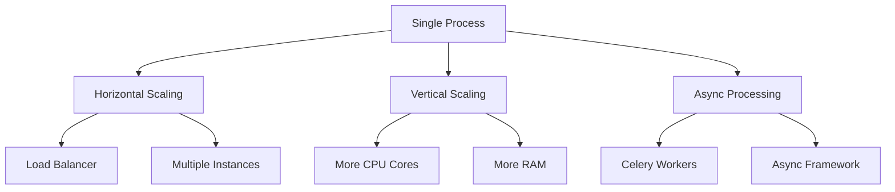

## Security Considerations

### Current Security Posture

**Authentication**: None (suitable for development/internal use)
**Authorization**: None (open access to all endpoints)
**Input Validation**: Pydantic models with type checking
**Rate Limiting**: None (could lead to resource exhaustion)

### Production Security Enhancements

#### 1. Authentication & Authorization

```python
# Example JWT implementation
from fastapi.security import HTTPBearer
from jose import jwt

security = HTTPBearer()

@app.dependency
async def get_current_user(token: str = Depends(security)):
    payload = jwt.decode(token, SECRET_KEY, algorithms=["HS256"])
    return payload["sub"]

@app.post("/plan", dependencies=[Depends(get_current_user)])
def plan(req: PlanRequest):
    # Protected endpoint
    pass
```

#### 2. Input Sanitization

```python
class PlanRequest(BaseModel):
    depart_city: str = Field(..., min_length=2, max_length=100, regex=r'^[a-zA-Z\s]+$')
    ac_type: str = Field(..., regex=r'^[A-Z0-9]{3,4}$')  # ICAO format
```

#### 3. Rate Limiting

```python
from slowapi import Limiter

limiter = Limiter(key_func=get_remote_address)

@app.post("/plan")
@limiter.limit("10/minute")
def plan(request: Request, req: PlanRequest):
    pass
```

#### 4. HTTPS/TLS

```bash
# Production deployment with TLS
uvicorn main:app --host 0.0.0.0 --port 443 \
    --ssl-keyfile key.pem --ssl-certfile cert.pem
```

### Data Privacy

**No PII Collection**: System doesn't collect personal information
**Audit Logging**: Consider logging for flight planning requests
**Data Retention**: No persistent storage of user requests

## Scalability & Future Enhancements

### Horizontal Scaling Architecture

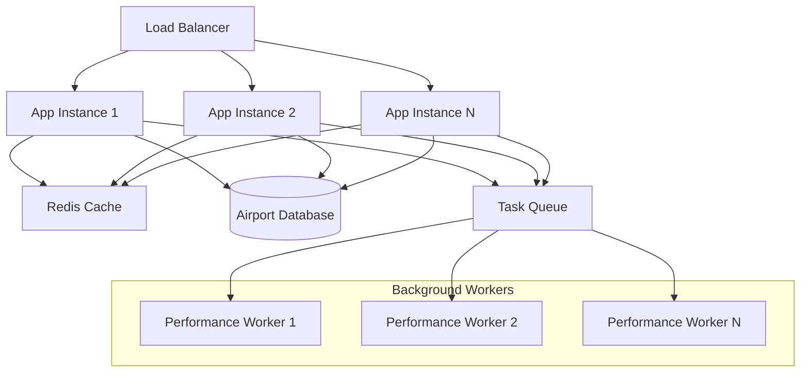

### Database Migration Strategy

**Phase 1**: Add optional database support alongside in-memory
```python
if DATABASE_URL:
    airports = load_from_database()
else:
    airports = airportsdata.load("IATA")  # Fallback
```

**Phase 2**: Implement caching layer
```python
@cache(ttl=3600)  # 1-hour cache
def find_city_airports(city: str, country: Optional[str]):
    return db.query_airports(city, country)
```

**Phase 3**: Full database migration with real-time updates

### Enhanced Features Roadmap

#### 1. Weather Integration
```python
class PlanRequest(BaseModel):
    include_weather: bool = False
    weather_source: Literal["noaa", "openweather"] = "noaa"

# Weather-adjusted performance calculations
def estimates_with_weather(ac_type, route, weather_data):
    # Adjust for winds, temperature, turbulence
    pass
```

#### 2. NOTAM Integration
```python
@app.get("/route/{flight_id}/notams")
def get_route_notams(flight_id: str):
    # Return NOTAMs affecting the route
    pass
```

#### 3. Multi-leg Flight Planning
```python
class MultiLegRequest(BaseModel):
    waypoints: List[str]  # City names or IATA codes
    aircraft: str
    stopovers: List[StopoverConfig] = []

class StopoverConfig(BaseModel):
    min_ground_time: int = 45  # minutes
    fuel_stop: bool = False
    passenger_stop: bool = True
```

#### 4. Real-time Flight Tracking
```python
@app.websocket("/ws/track/{flight_id}")
async def track_flight(websocket: WebSocket, flight_id: str):
    # Real-time position updates
    pass
```

### Performance Optimization Roadmap

#### 1. Caching Strategy
- **L1 Cache**: In-memory LRU cache for common requests
- **L2 Cache**: Redis for shared cache across instances  
- **L3 Cache**: CDN for static airport data

#### 2. Database Optimization
- **Indexing**: Spatial indexes for airport coordinates
- **Partitioning**: Partition by region/country
- **Read Replicas**: Separate read/write workloads

#### 3. Async Processing
```python
@app.post("/plan/async")
async def plan_async(req: PlanRequest):
    task_id = await queue_flight_plan.delay(req)
    return {"task_id": task_id}

@app.get("/plan/status/{task_id}")
async def get_plan_status(task_id: str):
    return await get_task_status(task_id)
```

### Monitoring & Observability

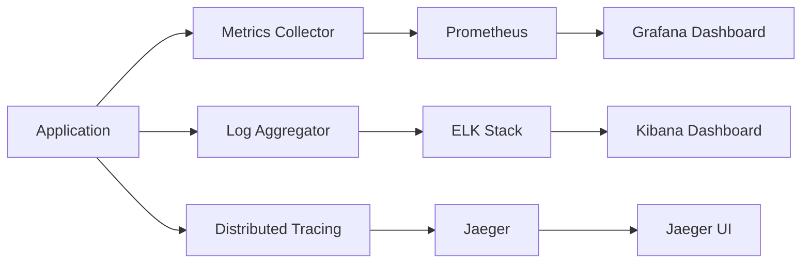

**Key Metrics to Monitor**:
- Request latency (p50, p95, p99)
- Error rates by endpoint
- OpenAP calculation time
- Memory usage trends
- Cache hit rates

**Alerting Thresholds**:
- Response time > 5 seconds
- Error rate > 5%
- Memory usage > 80%
- OpenAP unavailable

This architecture provides a solid foundation for the current requirements while maintaining flexibility for future enhancements and scaling needs.