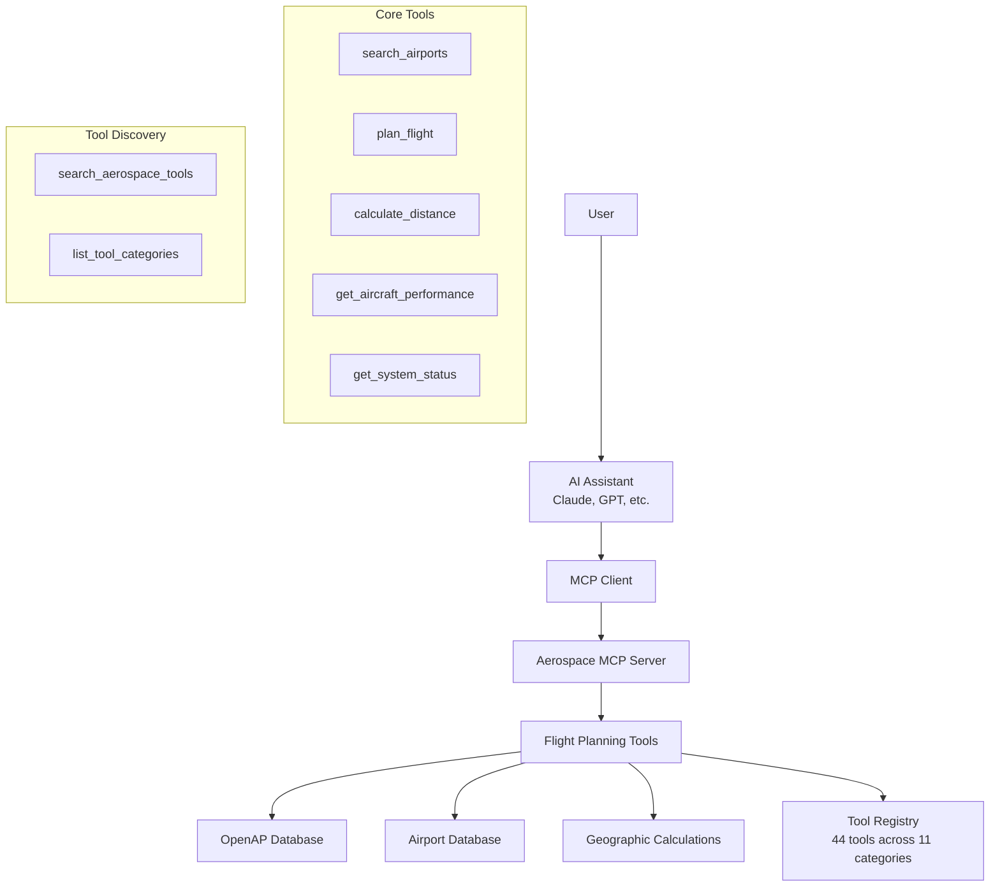

# MCP Integration Guide

Comprehensive guide for integrating Aerospace MCP with Model Context Protocol (MCP) clients, enabling AI assistants to access flight planning capabilities through natural language interactions.

## 📋 Table of Contents

- [MCP Overview](#mcp-overview)
- [Available Tools](#available-tools)
- [Claude Desktop Setup](#claude-desktop-setup)
- [VS Code Continue Setup](#vs-code-continue-setup)
- [Custom MCP Clients](#custom-mcp-clients)
- [Tool Usage Examples](#tool-usage-examples)
- [Advanced Configuration](#advanced-configuration)
- [Common Workflows](#common-workflows)
- [Troubleshooting](#troubleshooting)
- [Development & Testing](#development--testing)

## 🤖 MCP Overview

The Model Context Protocol (MCP) enables AI assistants to access external tools and data sources in a standardized way. Aerospace MCP implements the MCP specification to provide flight planning capabilities to AI assistants like Claude.

### Architecture



### Key Benefits

- **Natural Language Interface**: Users can interact with complex flight planning using plain English
- **AI-Powered Analysis**: Leverage AI capabilities for route optimization and recommendations
- **Contextual Understanding**: AI assistants can understand aviation context and provide relevant suggestions
- **Automated Workflows**: Create complex flight planning workflows through conversation

## 🛠️ Available Tools

### 1. search_airports

**Description**: Search for airports by IATA code or city name with optional country filtering.

**Parameters**:
```typescript
{
  query: string;           // IATA code or city name
  country?: string;        // Optional ISO country code
  query_type?: string;     // "iata", "city", or "auto"
}
```

**Example Usage**:
```
User: "Find airports in Tokyo"
Assistant: Uses search_airports tool with query="Tokyo"

User: "Look up SFO airport details"
Assistant: Uses search_airports tool with query="SFO", query_type="iata"
```

### 2. plan_flight

**Description**: Generate complete flight plans with route calculation and performance estimates.

**Parameters**:
```typescript
{
  departure: {
    city: string;           // Departure city
    country?: string;       // Departure country code
    iata?: string;          // Preferred IATA code
  };
  arrival: {
    city: string;           // Arrival city
    country?: string;       // Arrival country code
    iata?: string;          // Preferred IATA code
  };
  aircraft: {
    type: string;           // ICAO aircraft type
    cruise_altitude?: number; // Cruise altitude in feet
    mass_kg?: number;       // Aircraft mass
  };
  route_options?: {
    step_km?: number;       // Route sampling resolution
  };
}
```

**Example Usage**:
```
User: "Plan a flight from New York to London using an A350"
Assistant: Uses plan_flight tool with structured parameters

User: "What's the fuel requirement for a 777 from LAX to NRT at FL410?"
Assistant: Plans flight with specific aircraft and altitude
```

### 3. calculate_distance

**Description**: Calculate great-circle distance between two coordinate points.

**Parameters**:
```typescript
{
  origin: {
    latitude: number;       // Origin latitude (-90 to 90)
    longitude: number;      // Origin longitude (-180 to 180)
  };
  destination: {
    latitude: number;       // Destination latitude
    longitude: number;      // Destination longitude
  };
  step_km?: number;         // Polyline sampling step
}
```

**Example Usage**:
```
User: "What's the distance between coordinates 40.7128,-74.0060 and 51.5074,-0.1278?"
Assistant: Uses calculate_distance tool with the coordinates
```

### 4. get_aircraft_performance

**Description**: Get detailed performance estimates for specific aircraft types.

**Parameters**:
```typescript
{
  aircraft_type: string;    // ICAO aircraft type
  distance_km: number;      // Route distance
  cruise_altitude?: number; // Cruise altitude in feet
  mass_kg?: number;         // Aircraft mass
}
```

**Example Usage**:
```
User: "How much fuel does an A320 need for a 1000km flight?"
Assistant: Uses get_aircraft_performance tool with specified parameters
```

### 5. get_system_status

**Description**: Check system health and capabilities.

**Parameters**: None

**Example Usage**:
```
User: "Is the flight planning system working?"
Assistant: Uses get_system_status tool to check service health
```

### 6. search_aerospace_tools

**Description**: Search for aerospace-mcp tools by name, description, or functionality. Implements Anthropic's tool search pattern for dynamic tool discovery.

**Parameters**:
```typescript
{
  query: string;              // Search query (regex pattern or natural language)
  search_type?: string;       // "regex", "text", or "auto" (default: "auto")
  max_results?: number;       // Maximum results to return (default: 5, max: 10)
  category?: string;          // Optional category filter
}
```

**Example Usage**:
```
User: "What tools can help with orbital mechanics?"
Assistant: Uses search_aerospace_tools with query="orbital mechanics"
Returns: propagate_orbit_j2, elements_to_state_vector, hohmann_transfer, etc.

User: "Find all rocket-related tools"
Assistant: Uses search_aerospace_tools with query=".*rocket.*", search_type="regex"
Returns: rocket_3dof_trajectory, estimate_rocket_sizing, optimize_launch_angle
```

### 7. list_tool_categories

**Description**: List all available tool categories with tool counts.

**Parameters**: None

**Example Usage**:
```
User: "What categories of tools are available?"
Assistant: Uses list_tool_categories to show all 9 categories with tool counts
```

## 🖥️ Claude Desktop Setup

### Prerequisites

- Claude Desktop installed
- Python 3.11+ with Aerospace MCP installed
- Access to Claude Desktop configuration file

### Configuration Steps

1. **Locate Configuration File**

   The Claude Desktop configuration file location varies by operating system:

   - **Windows**: `%APPDATA%\Claude\config.json`
   - **macOS**: `~/Library/Application Support/Claude/config.json`
   - **Linux**: `~/.config/Claude/config.json`

2. **Basic Configuration**

   Add the following to your `config.json`:

   ```json
   {
     "mcpServers": {
       "aerospace-mcp": {
         "command": "python",
         "args": ["-m", "aerospace_mcp.server"],
         "cwd": "/absolute/path/to/aerospace-mcp"
       }
     }
   }
   ```

3. **Advanced Configuration**

   For more control over the server:

   ```json
   {
     "mcpServers": {
       "aerospace-mcp": {
         "command": "python",
         "args": [
           "-m", "aerospace_mcp.server"
         ],
         "cwd": "/absolute/path/to/aerospace-mcp",
         "env": {
           "PYTHONPATH": "/absolute/path/to/aerospace-mcp",
           "LOG_LEVEL": "info",
           "OPENAP_CACHE_SIZE": "1000"
         }
       }
     }
   }
   ```

4. **Virtual Environment Configuration**

   If using a virtual environment:

   ```json
   {
     "mcpServers": {
       "aerospace-mcp": {
         "command": "/absolute/path/to/aerospace-mcp/.venv/bin/python",
         "args": ["-m", "aerospace_mcp.server"],
         "cwd": "/absolute/path/to/aerospace-mcp"
       }
     }
   }
   ```

5. **UV Configuration**

   If installed with UV package manager:

   ```json
   {
     "mcpServers": {
       "aerospace-mcp": {
         "command": "uv",
         "args": ["run", "python", "-m", "aerospace_mcp.server"],
         "cwd": "/absolute/path/to/aerospace-mcp"
       }
     }
   }
   ```

### Verification

1. **Restart Claude Desktop**
2. **Test Integration**:

   Type these example queries to verify the integration:

   ```
   "Search for airports in Paris"
   "Plan a flight from San Francisco to New York using an A320"
   "What's the system status of the flight planning service?"
   ```

3. **Check Server Status**:

   The assistant should be able to access the tools. You should see responses like:

   ```
   I found several airports in Paris:
   • CDG (LFPG) - Charles de Gaulle Airport
   • ORY (LFPO) - Orly Airport
   ```

## 🔧 VS Code Continue Setup

### Prerequisites

- VS Code installed
- Continue extension installed
- Python 3.11+ with Aerospace MCP installed

### Configuration Steps

1. **Open Continue Configuration**

   - Open VS Code
   - Access Continue settings (usually `Ctrl/Cmd + Shift + P` > "Continue: Open Config")
   - Or edit `~/.continue/config.json` directly

2. **Add MCP Server**

   ```json
   {
     "models": [
       {
         "title": "Claude 3.5 Sonnet",
         "provider": "anthropic",
         "model": "claude-3-5-sonnet-20241022",
         "apiKey": "your-api-key"
       }
     ],
     "mcpServers": [
       {
         "name": "aerospace-mcp",
         "command": "python",
         "args": ["-m", "aerospace_mcp.server"],
         "workingDirectory": "/absolute/path/to/aerospace-mcp"
       }
     ]
   }
   ```

3. **With Virtual Environment**

   ```json
   {
     "models": [...],
     "mcpServers": [
       {
         "name": "aerospace-mcp",
         "command": "/absolute/path/to/aerospace-mcp/.venv/bin/python",
         "args": ["-m", "aerospace_mcp.server"],
         "workingDirectory": "/absolute/path/to/aerospace-mcp",
         "env": {
           "PYTHONPATH": "/absolute/path/to/aerospace-mcp"
         }
       }
     ]
   }
   ```

### Usage in VS Code

Once configured, you can use flight planning capabilities in your code comments or Continue chat:

```python
# Continue: Plan a flight from Boston to Seattle using a B737
# Continue: What airports are available in London?
# Continue: Calculate fuel requirements for an A320 on a 500nm route
```

## 🔨 Custom MCP Clients

### Python MCP Client

Create a custom client to interact with Aerospace MCP:

```python
# custom_mcp_client.py
import asyncio
from mcp.client import ClientSession, StdioServerParameters
from mcp.client.stdio import stdio_client

async def main():
    """Custom MCP client example."""

    # Server parameters
    server_params = StdioServerParameters(
        command="python",
        args=["-m", "aerospace_mcp.server"],
        cwd="/path/to/aerospace-mcp"
    )

    async with stdio_client(server_params) as (read, write):
        async with ClientSession(read, write) as session:
            # Initialize the session
            await session.initialize()

            # List available tools
            tools_result = await session.list_tools()
            print("Available tools:")
            for tool in tools_result.tools:
                print(f"  - {tool.name}: {tool.description}")

            # Search for airports
            search_result = await session.call_tool(
                "search_airports",
                arguments={
                    "query": "Tokyo",
                    "country": "JP"
                }
            )
            print(f"\nTokyo airports: {search_result.content[0].text}")

            # Plan a flight
            flight_result = await session.call_tool(
                "plan_flight",
                arguments={
                    "departure": {"city": "Tokyo"},
                    "arrival": {"city": "Osaka"},
                    "aircraft": {"type": "B737"}
                }
            )
            print(f"\nFlight plan: {flight_result.content[0].text}")

if __name__ == "__main__":
    asyncio.run(main())
```

### JavaScript/TypeScript Client

```typescript
// mcp-client.ts
import { Client } from '@modelcontextprotocol/sdk/client/index.js';
import { StdioServerTransport } from '@modelcontextprotocol/sdk/client/stdio.js';

class AerospaceMCPClient {
  private client: Client;
  private transport: StdioServerTransport;

  constructor(serverPath: string) {
    this.transport = new StdioServerTransport({
      command: 'python',
      args: ['-m', 'aerospace_mcp.server'],
      cwd: serverPath
    });

    this.client = new Client({
      name: 'aerospace-mcp-client',
      version: '1.0.0'
    }, {
      capabilities: {
        tools: {}
      }
    });
  }

  async connect(): Promise<void> {
    await this.client.connect(this.transport);
  }

  async searchAirports(city: string, country?: string): Promise<string> {
    const result = await this.client.callTool({
      name: 'search_airports',
      arguments: {
        query: city,
        country: country,
        query_type: 'city'
      }
    });

    return result.content[0].text;
  }

  async planFlight(
    departureCity: string,
    arrivalCity: string,
    aircraftType: string,
    cruiseAltitude: number = 35000
  ): Promise<string> {
    const result = await this.client.callTool({
      name: 'plan_flight',
      arguments: {
        departure: { city: departureCity },
        arrival: { city: arrivalCity },
        aircraft: {
          type: aircraftType,
          cruise_altitude: cruiseAltitude
        }
      }
    });

    return result.content[0].text;
  }

  async disconnect(): Promise<void> {
    await this.client.close();
  }
}

// Usage example
async function example() {
  const client = new AerospaceMCPClient('/path/to/aerospace-mcp');

  try {
    await client.connect();

    const airports = await client.searchAirports('London', 'GB');
    console.log('London airports:', airports);

    const flightPlan = await client.planFlight(
      'London', 'Paris', 'A320', 35000
    );
    console.log('Flight plan:', flightPlan);

  } finally {
    await client.disconnect();
  }
}
```

## 📖 Tool Usage Examples

### Natural Language Interactions

#### Basic Airport Search

```
User: "What airports are available in San Francisco?"

Assistant Response:
Found 3 airport(s):
• SFO (KSFO) - San Francisco International Airport
  City: San Francisco, US
  Coordinates: 37.6213, -122.3790
  Timezone: America/Los_Angeles
• OAK (KOAK) - Oakland International Airport
  City: Oakland, US
  Coordinates: 37.7213, -122.2208
• SJC (KSJC) - San Jose International Airport
  City: San Jose, US
  Coordinates: 37.3639, -121.9289
```

#### Flight Planning

```
User: "I need to plan a flight from Chicago to Denver using a Boeing 737"

Assistant Response:
Flight Plan: ORD → DEN
Route: Chicago O'Hare International Airport → Denver International Airport
Distance: 1130 km (611 NM)
Aircraft: B737
Cruise Altitude: 35,000 ft

Performance Estimates (OpenAP):
• Block Time: 145 minutes (2.4 hours)
• Block Fuel: 3,245 kg

Flight Segments:
• Climb: 8 min, 65 km, 456 kg fuel
• Cruise: 125 min, 1000 km, 2456 kg fuel
• Descent: 12 min, 65 km, 333 kg fuel

Route Polyline: 46 points (every 25 km)
Mass Assumption: 68,850 kg
```

#### International Flight with Specific Airports

```
User: "Plan a long-haul flight from JFK to Heathrow using an A350, cruise at FL410"

Assistant Response:
Flight Plan: JFK → LHR
Route: John F Kennedy International Airport → Heathrow Airport
Distance: 5585 km (3016 NM)
Aircraft: A350
Cruise Altitude: 41,000 ft

Performance Estimates (OpenAP):
• Block Time: 421 minutes (7.0 hours)
• Block Fuel: 18,234 kg

Flight Segments:
• Climb: 15 min, 125 km, 2,456 kg fuel
• Cruise: 385 min, 5335 km, 14,567 kg fuel
• Descent: 21 min, 125 km, 1,211 kg fuel

Route Polyline: 224 points (every 25 km)
Mass Assumption: 245,000 kg
```

#### Aircraft Performance Comparison

```
User: "Compare fuel consumption between an A320 and B737 for a 1000km flight"

Assistant Response:
I'll analyze the fuel consumption for both aircraft on a 1000km route:

**Airbus A320:**
Aircraft Performance Estimates (openap)
Aircraft: A320
Distance: 1000 km
Cruise Altitude: 35,000 ft
Mass: 68,850 kg

Block Estimates:
• Time: 134 minutes (2.2 hours)
• Fuel: 2,845 kg

**Boeing B737:**
Aircraft Performance Estimates (openap)
Aircraft: B737
Distance: 1000 km
Cruise Altitude: 35,000 ft
Mass: 65,280 kg

Block Estimates:
• Time: 128 minutes (2.1 hours)
• Fuel: 2,934 kg

**Comparison:**
The A320 uses approximately 89 kg less fuel than the B737 for this route, while taking 6 minutes longer. The A320 is about 3% more fuel-efficient for this distance.
```

#### System Status Check

```
User: "Is the flight planning system operational?"

Assistant Response:
Aerospace MCP Server Status
OpenAP Available: Yes
Airports Loaded: 28,756

Available Tools:
• search_airports - Search for airports by IATA or city
• plan_flight - Plan flight routes with performance estimates
• calculate_distance - Calculate great circle distances
• get_aircraft_performance - Get aircraft performance estimates
• get_system_status - Get this status information

The system is fully operational with all capabilities available.
```

### Advanced Usage Patterns

#### Multi-City Journey Planning

```
User: "Plan a round-the-world trip: New York → London → Dubai → Singapore → Tokyo → Los Angeles → New York, using appropriate aircraft for each leg"

Assistant Response:
I'll plan each leg of your round-the-world journey with appropriate aircraft:

**Leg 1: New York (JFK) → London (LHR)**
Aircraft: A330 (suitable for transatlantic)
Distance: 5,585 km (3,016 NM)
Block Time: 7.2 hours
Block Fuel: 16,234 kg

**Leg 2: London (LHR) → Dubai (DXB)**
Aircraft: B777 (long-haul efficiency)
Distance: 5,493 km (2,966 NM)
Block Time: 6.8 hours
Block Fuel: 18,445 kg

**Leg 3: Dubai (DXB) → Singapore (SIN)**
Aircraft: A350 (ultra-long-range)
Distance: 6,138 km (3,314 NM)
Block Time: 7.5 hours
Block Fuel: 19,678 kg

**Leg 4: Singapore (SIN) → Tokyo (NRT)**
Aircraft: B787 (medium-long-haul)
Distance: 5,308 km (2,866 NM)
Block Time: 6.9 hours
Block Fuel: 15,234 kg

**Leg 5: Tokyo (NRT) → Los Angeles (LAX)**
Aircraft: B777 (transpacific capability)
Distance: 8,815 km (4,760 NM)
Block Time: 10.8 hours
Block Fuel: 28,567 kg

**Leg 6: Los Angeles (LAX) → New York (JFK)**
Aircraft: A321XLR (transcontinental)
Distance: 3,983 km (2,150 NM)
Block Time: 5.2 hours
Block Fuel: 8,234 kg

**Journey Summary:**
Total Distance: 35,322 km (19,072 NM)
Total Flight Time: 44.4 hours
Total Fuel: 106,392 kg
```

## ⚙️ Advanced Configuration

### Server Environment Variables

You can configure the MCP server behavior through environment variables:

```json
{
  "mcpServers": {
    "aerospace-mcp": {
      "command": "python",
      "args": ["-m", "aerospace_mcp.server"],
      "cwd": "/path/to/aerospace-mcp",
      "env": {
        "LOG_LEVEL": "debug",
        "OPENAP_CACHE_SIZE": "2000",
        "OPENAP_TIMEOUT": "60",
        "DEFAULT_CRUISE_ALTITUDE": "37000",
        "DEFAULT_ROUTE_STEP_KM": "50",
        "AIRPORT_SEARCH_LIMIT": "10"
      }
    }
  }
}
```

### Custom Tool Configuration

Modify tool behavior by creating a custom configuration:

```python
# custom_mcp_config.py
from aerospace_mcp.server import server, TOOLS
from mcp.types import Tool

# Add custom tool
custom_tool = Tool(
    name="plan_cargo_flight",
    description="Plan flights optimized for cargo operations",
    inputSchema={
        "type": "object",
        "properties": {
            "origin_iata": {"type": "string"},
            "destination_iata": {"type": "string"},
            "cargo_weight_kg": {"type": "number"},
            "aircraft_type": {"type": "string"}
        },
        "required": ["origin_iata", "destination_iata", "cargo_weight_kg"]
    }
)

# Add to tools list
TOOLS.append(custom_tool)

# Add handler
@server.call_tool()
async def handle_cargo_flight(name: str, arguments: dict):
    if name == "plan_cargo_flight":
        # Custom cargo flight planning logic
        return await _handle_cargo_flight(arguments)
```

### Performance Tuning

```json
{
  "mcpServers": {
    "aerospace-mcp": {
      "command": "python",
      "args": [
        "-m", "aerospace_mcp.server",
        "--workers", "2",
        "--cache-size", "1000"
      ],
      "cwd": "/path/to/aerospace-mcp",
      "env": {
        "PYTHONPATH": "/path/to/aerospace-mcp",
        "ASYNCIO_THREAD_POOL_SIZE": "4",
        "OPENAP_PRELOAD": "true"
      }
    }
  }
}
```

## 🔄 Common Workflows

### Workflow 1: Route Planning & Optimization

```
1. User: "I need to find the most efficient route from Seattle to Miami"

2. Assistant:
   - Uses search_airports to find options in both cities
   - Uses plan_flight with different aircraft types
   - Compares results and recommends optimal choice

3. User: "What if I need to make a fuel stop?"

4. Assistant:
   - Calculates intermediate airports within aircraft range
   - Plans multi-leg journey with fuel stops
   - Provides total journey time and fuel requirements
```

### Workflow 2: Fleet Analysis

```
1. User: "Compare operating costs for A320 vs B737 on our Seattle-Denver route"

2. Assistant:
   - Uses plan_flight for both aircraft types
   - Calculates fuel consumption differences
   - Provides time and efficiency comparisons
   - Suggests optimal aircraft for the route

3. User: "What about passenger capacity differences?"

4. Assistant:
   - References aircraft specifications
   - Calculates cost per passenger
   - Provides recommendations based on load factors
```

### Workflow 3: Emergency Diversion Planning

```
1. User: "Plan emergency diversions from current position 35.5N 120.3W"

2. Assistant:
   - Uses calculate_distance to find nearest airports
   - Plans routes to multiple diversion airports
   - Provides fuel requirements for each option
   - Ranks options by distance and suitability

3. User: "Which diversion airport has the longest runway?"

4. Assistant:
   - Searches airport database for runway information
   - Provides detailed airport specifications
   - Recommends best option for aircraft type
```

## 🔧 Troubleshooting

### Common Issues

#### 1. Server Not Starting

**Symptoms**: Claude Desktop shows MCP server connection errors

**Debug Steps**:
```bash
# Test server manually
cd /path/to/aerospace-mcp
python -m aerospace_mcp.server

# Check for import errors
python -c "import aerospace_mcp.server; print('OK')"

# Verify dependencies
python -c "import openap, airportsdata, geographiclib; print('All dependencies OK')"
```

**Solutions**:
- Ensure absolute paths in configuration
- Verify Python environment has all dependencies
- Check file permissions
- Verify working directory exists

#### 2. Tools Not Available

**Symptoms**: Assistant reports "No tools available" or specific tools missing

**Debug Steps**:
```python
# Test tool listing
import asyncio
from aerospace_mcp.server import server

async def test_tools():
    tools = await server.list_tools()
    for tool in tools:
        print(f"Available: {tool.name}")

asyncio.run(test_tools())
```

**Solutions**:
- Restart Claude Desktop after configuration changes
- Verify MCP server configuration syntax
- Check server logs for initialization errors

#### 3. OpenAP Not Available

**Symptoms**: Performance estimates show errors or "OpenAP unavailable"

**Debug Steps**:
```bash
# Test OpenAP installation
python -c "import openap; print(f'OpenAP version: {openap.__version__}')"

# Test aircraft data loading
python -c "
from openap import prop
print(prop.aircraft('A320'))
"
```

**Solutions**:
```bash
# Install/reinstall OpenAP
pip install --upgrade openap

# Alternative installation methods
conda install -c conda-forge openap
pip install openap --no-cache-dir
```

#### 4. Slow Response Times

**Symptoms**: Long delays when using flight planning tools

**Optimizations**:
```json
{
  "mcpServers": {
    "aerospace-mcp": {
      "env": {
        "OPENAP_CACHE_SIZE": "2000",
        "DEFAULT_ROUTE_STEP_KM": "100",
        "AIRPORT_CACHE_TTL": "3600"
      }
    }
  }
}
```

#### 5. Memory Usage Issues

**Symptoms**: High memory consumption, system slowdowns

**Solutions**:
- Reduce OpenAP cache size
- Increase route step size for less detailed routes
- Monitor system resources
- Consider using external database for airport data

### Diagnostic Commands

**Test MCP Connection**:
```python
# test_mcp_connection.py
import asyncio
from mcp.client import ClientSession, StdioServerParameters
from mcp.client.stdio import stdio_client

async def test_connection():
    server_params = StdioServerParameters(
        command="python",
        args=["-m", "aerospace_mcp.server"],
        cwd="/path/to/aerospace-mcp"
    )

    try:
        async with stdio_client(server_params) as (read, write):
            async with ClientSession(read, write) as session:
                await session.initialize()
                print("✅ MCP connection successful")

                tools = await session.list_tools()
                print(f"✅ Found {len(tools.tools)} tools")

                # Test a simple tool
                result = await session.call_tool("get_system_status", {})
                print(f"✅ System status: {result.content[0].text[:100]}...")

    except Exception as e:
        print(f"❌ Connection failed: {e}")

if __name__ == "__main__":
    asyncio.run(test_connection())
```

## 🧪 Development & Testing

### Local Development

1. **Clone and Setup**:
```bash
git clone https://github.com/username/aerospace-mcp.git
cd aerospace-mcp
python -m venv .venv
source .venv/bin/activate  # Windows: .venv\Scripts\activate
pip install -e .
```

2. **Test MCP Server**:
```bash
# Run server directly
python -m aerospace_mcp.server

# Test with stdio
echo '{"jsonrpc": "2.0", "id": 1, "method": "list_tools", "params": {}}' | python -m aerospace_mcp.server
```

3. **Development Configuration**:
```json
{
  "mcpServers": {
    "aerospace-mcp-dev": {
      "command": "python",
      "args": ["-m", "aerospace_mcp.server"],
      "cwd": "/path/to/aerospace-mcp",
      "env": {
        "LOG_LEVEL": "debug",
        "DEV_MODE": "true"
      }
    }
  }
}
```

### Testing Tools

**Unit Tests for MCP Tools**:
```python
# test_mcp_tools.py
import pytest
from aerospace_mcp.server import _handle_search_airports, _handle_plan_flight

@pytest.mark.asyncio
async def test_search_airports():
    """Test airport search tool."""
    result = await _handle_search_airports({
        "query": "San Francisco",
        "query_type": "city"
    })

    assert len(result) == 1
    assert "SFO" in result[0].text
    assert "San Francisco International" in result[0].text

@pytest.mark.asyncio
async def test_plan_flight():
    """Test flight planning tool."""
    result = await _handle_plan_flight({
        "departure": {"city": "New York"},
        "arrival": {"city": "Los Angeles"},
        "aircraft": {"type": "A320"}
    })

    assert len(result) == 1
    assert "JFK" in result[0].text or "LGA" in result[0].text
    assert "LAX" in result[0].text
    assert "A320" in result[0].text
```

**Integration Tests**:
```python
# test_mcp_integration.py
import asyncio
import pytest
from mcp.client import ClientSession, StdioServerParameters
from mcp.client.stdio import stdio_client

@pytest.mark.asyncio
async def test_full_mcp_integration():
    """Test full MCP integration."""
    server_params = StdioServerParameters(
        command="python",
        args=["-m", "aerospace_mcp.server"],
        cwd="/path/to/aerospace-mcp"
    )

    async with stdio_client(server_params) as (read, write):
        async with ClientSession(read, write) as session:
            await session.initialize()

            # Test tool listing
            tools_result = await session.list_tools()
            tool_names = [tool.name for tool in tools_result.tools]
            expected_tools = [
                "search_airports", "plan_flight", "calculate_distance",
                "get_aircraft_performance", "get_system_status"
            ]

            for tool in expected_tools:
                assert tool in tool_names

            # Test airport search
            search_result = await session.call_tool(
                "search_airports",
                {"query": "London", "country": "GB"}
            )
            assert "LHR" in search_result.content[0].text
```

### Performance Testing

**Load Testing**:
```python
# performance_test.py
import asyncio
import time
from mcp.client import ClientSession, StdioServerParameters
from mcp.client.stdio import stdio_client

async def performance_test():
    """Test MCP server performance."""
    server_params = StdioServerParameters(
        command="python",
        args=["-m", "aerospace_mcp.server"],
        cwd="/path/to/aerospace-mcp"
    )

    async with stdio_client(server_params) as (read, write):
        async with ClientSession(read, write) as session:
            await session.initialize()

            # Test multiple concurrent requests
            start_time = time.time()

            tasks = []
            for i in range(10):
                task = session.call_tool("get_system_status", {})
                tasks.append(task)

            results = await asyncio.gather(*tasks)
            end_time = time.time()

            print(f"10 concurrent requests completed in {end_time - start_time:.2f}s")
            print(f"Average response time: {(end_time - start_time) / 10:.3f}s")

if __name__ == "__main__":
    asyncio.run(performance_test())
```

---

This comprehensive MCP integration guide provides everything needed to successfully integrate Aerospace MCP with AI assistants and custom applications. The natural language interface opens up powerful possibilities for aviation professionals and enthusiasts to interact with complex flight planning data through conversational AI.

For additional support, check the main project documentation and GitHub issues for community discussions and troubleshooting help.
